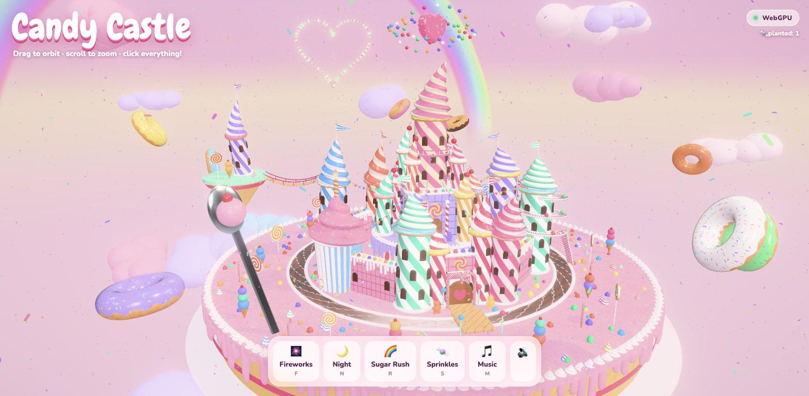
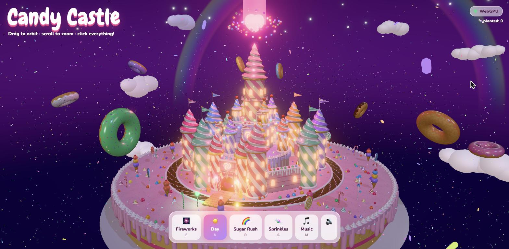
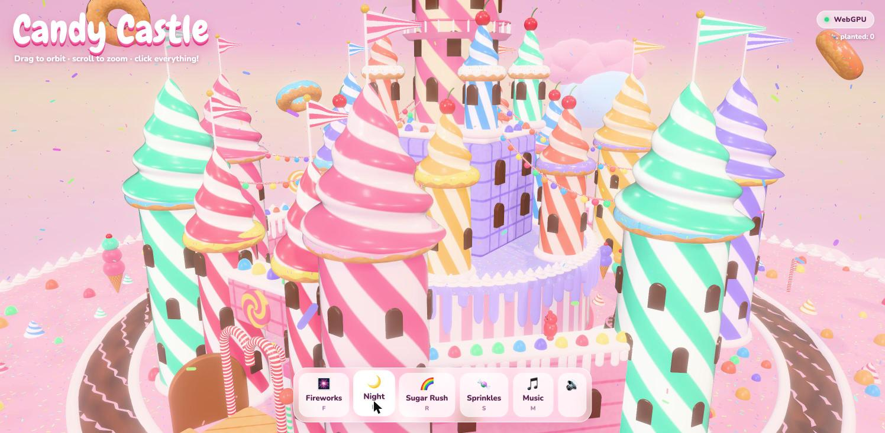

# 🍭 Candy Castle

An interactive 3D candy fortress on a floating layered cake, built with **three.js r186** and the **WebGPU renderer**. All materials are written in TSL, the three.js shading language. If a browser has no WebGPU, the page falls back to WebGL 2.







## The castle

The castle assembles itself piece by piece while the camera flies in:

- **An octagonal curtain wall** of strawberry wafer, topped with gumdrops and dripping icing, with **eight flagged towers** at its corners.
- **A gatehouse** with twin towers, a glowing swirl emblem, a candy-cane arch and a gingerbread door that swings open.
- **A raised cake terrace** with a candy-bar staircase and six turrets around it.
- **The Royal Keep** with candy-cane columns, a rose window and four corner turrets. Above it stands **the great spire** with a balcony.
- **The Crystal Sugar Heart**, an iridescent heart floating above the spire. Gumball rings orbit it, and at night it casts pink light and a beam into the sky.
- **Festival lights** strung from the spire to every outer tower.
- **Two chocolate fountains** in the courtyard, a chocolate moat, and **gummy bear guards** that patrol the walls, guard the gate and dance on the terrace.

No two towers are alike. They have different heights and widths, their soft-serve roofs curl sideways, and many lean a little. The walls are uneven too. The layout comes from a fixed random seed, so every visitor sees the same crooked castle. The strangest parts:

- **A gumball helter-skelter** spirals around one tower. Gumballs roll down it endlessly and drop into the chocolate moat.
- **A birthday-cupcake tower** with a flickering candle.
- **The Floating Sprinkle Isle**, a chunk of cake that broke off and drifts beside the castle, joined to it by a licorice rope bridge.
- **A giant's spoon** stuck in the cake, holding a scoop of strawberry.

**Live demo:** https://hilimor.github.io/candy-castle/

## Things to click

| Click | What happens |
| --- | --- |
| 💖 The crystal heart | The grand finale: fireworks, a light flash, and every bear and tower jumps |
| 🏰 Towers | They squash and bounce, spray sprinkles and launch a firework |
| 🐻 Gummy bears | They jump |
| 🎂 The cupcake tower | Blow out the candle and make a wish; it relights with a firework |
| 🌀 The gumball slide | The gumballs speed up |
| 🏝️ The floating island | It wobbles |
| 🥄 The giant spoon | Clang! |
| ⛲ Chocolate fountains | A chocolatey splash |
| 👑 The keep | A full fireworks show |
| 🍭 Lollipops | They spin and chime |
| 🟣 Gumdrops | They hop |
| 🍩 Flying donuts, ☁️ clouds, 🍦 ice-cream trees, 🍬 candy canes | Each does something |
| 🚪 Gingerbread gate | It swings open |
| 🍫 Chocolate river | A splash |
| 🧁 The frosting ground | Plants new candy that grows in with an elastic animation |

**Controls:** drag to orbit, scroll to zoom. Keyboard shortcuts:
`F` fireworks · `N` day/night · `R` sugar rush · `S` sprinkle storm · `M` music · `B` rebuild the castle · `H` hide UI

## Under the hood

- **WebGPU compute shader.** Thousands of sprinkles rain from the sky, animated on the GPU with `instancedArray` and `Fn().compute()`.
- **Procedural TSL materials.** No textures are loaded. Everything is shader code: helical candy stripes, lollipop swirls, wafer grids, waffle cones, sprinkle patterns, donut icing, a spongy cake, a flowing chocolate river, sugar-crystal glitter, and a sky with stars that twinkle at night.
- **Soft-serve roofs.** Lathe geometry is twisted into a helical ridge.
- **Merged static geometry.** Each tower, wall ring and terrace is baked into one mesh per material, so the large castle stays cheap to draw.
- **Waving flags.** The vertex shader squeezes each flag into a pennant shape and animates the wind.
- **Post-processing.** Bloom, a sugar-rush hue spin with a saturation boost, and a vignette, all built with `RenderPipeline`.
- **Day/night cycle.** Candle-lit windows, glowing gumball lamps with point lights, stars and a moon.
- **Fireworks.** Sphere, ring and heart-shaped bursts with HDR sparks.
- **Synthesized audio.** Every pop, boing, chime, whoosh and boom, plus the music-box melody, is generated live with WebAudio. There are no audio files.

## Run locally

No build step is needed. Serve the folder with any static server:

```bash
python3 -m http.server 8000
# open http://localhost:8000
```

## Files

```
index.html        UI, styles, import map (three.js from jsDelivr)
src/main.js       renderer, camera, post-processing, interaction, main loop
src/world.js      the cake island, castle, garden, donuts, clouds, sky, rainbow
src/materials.js  TSL shader materials
src/effects.js    GPU sprinkle rain, sprinkle bursts, fireworks
src/anim.js       squash/stretch springs, spins, elastic growth
src/audio.js      WebAudio sound effects and music box
```
